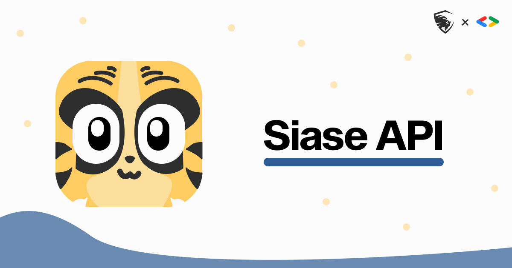

<br />
<p align="center">
    

  <h1 align="center">SIASE API</h1>

  <h3 align="center">
   Un REST API de código abierto que proporciona los datos de SIASE
    <br />
  </h3>
</p>


<br>

[](https://discord.gg/ZS52h7HKKJ)

<!-- ABOUT THE PROJECT -->

## Acerca del proyecto

* [Documentación](https://siaseapi.docs.apiary.io/#)

SIASE API es un REST API de código abierto que utiliza webscraping para obtener los datos de la plataforma de SIASE de la UANL, con esta api podrás acceder a tu información como las carreras que estas cursando, los horarios e incluso consultar tu kardex.

Puedes utilizar esta API para construir cualquier proyecto que desees o contribuir para mejorarla.

SIASE API y el GDSC no estamos afiliados de ninguna manera con la UANL, este es un proyecto hecho por y para estudiantes.


<br>

## Errores, mejoras y contribuciones

Por favor asegurate de leer las guías de contribución.

<details><summary>Issues</summary>

1. **Antes de reportar un issue por favor echa un vistazo a los [issues](https://github.com/GDSC-UANL/siase-api/issues) abiertos.**
2. Si tienes alguna duda puedes preguntar en nuestro [Discord](https://discord.gg/ZS52h7HKKJ)

</details>

<details><summary>Bugs</summary>

* Incluye los pasos para reproducir
* Incluye screenshots si es necesario 

</details>

<details><summary>Feature requests</summary>

* Escribe una explicación detallada, donde se menciona que es lo que se debería de hacer y como.
* Incluye screenshots si es necesario 
* Ten en cuenta que estamos limitados a las capacidades de la plataforma de SIASE

</details>

<details><summary>Contribuciones</summary>

Por favor mira nuestro apartado de [contribuciones](https://github.com/GDSC-UANL/siase-api/blob/master/contributing.md)

</details>

<br>

## 💻 Herramientas de desarrollo

<!-- Herramientas de desarrollo -->
<table>
<tr>
    <td align="center">
        <a href="https://nodejs.org">
            
            <br />
            <sub><b>NodeJS</b></sub>
        </a>
    </td>
    <td align="center">
        <a href="https://www.typescriptlang.org/">
            
            <br />
            <sub><b>TypeScript</b></sub>
        </a>
    </td>
    <td align="center">
        <a href="https://expressjs.com/">
            
            <br />
            <sub><b>Express</b></sub>
        </a>
    </td>
    <td align="center" style="line-height: 8;">
        <a href="https://cheerio.js.org/">
            <b>Cheerio</b>
        </a>
    </td>
    <td align="center">
        <a href="https://expressjs.com/">
            
            <br />
            <sub><b>Axios</b></sub>
        </a>
    </td>
    <td align="center">
        <a href="https://expressjs.com/">
            
            <br />
            <sub><b>JWT</b></sub>
        </a>
    </td>
  </tr>
</table>

<!-- GETTING STARTED -->
<br>

## Iniciar un servidor local de desarrollo
Antes de clonar el repositorio asegurate de tener instalado:

- NodeJS [](https://nodejs.org/es/)
- NPM [](https://nodejs.org/es/)


- Una vez que hayas descargado el repositorio instala las dependencias utilizando

```
  npm install
```

- Crea un archivo .env en el directorio principal y llenalo con las variables necesarias. Puedes ver las variables requeridas en el archivo [EXAMPLE.env](https://github.com/GDSC-UANL/siase-api/blob/master/EXAMPLE.env).

- Ejecuta el servidor utilizando

```
  npm run build && npm run start
```

## ✍ Colaboradores
<!-- COLABORADORES -->
<table>
<tr>
    <td align="center">
        <a href="https://github.com/Fmaldonado6">
            
            <br />
            <sub><b>Fmaldonado6</b></sub>
        </a>
    </td>
    <td align="center">
        <a href="https://github.com/David-Lazaro-Fernandez">
            
            <br />
            <sub><b>David-Lazaro-Fernandez</b></sub>
        </a>
    </td>
    <td align="center">
        <a href="https://github.com/FabianCruz-0">
            
            <br />
            <sub><b>FabianCruz-0</b></sub>
        </a>
    </td>
    <td align="center">
        <a href="https://github.com/rtrevinnoc">
            
            <br />
            <sub><b>rtrevinnoc</b></sub>
        </a>
    </td>
  </tr>
</table>

<!-- CONTACT -->
<br>

## Contact

GDSC UANL - [@dscuanl](https://twitter.com/gdscuanl) - dscuanl@gmail.com
